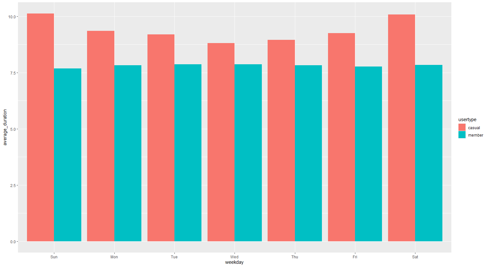

# 🚴 Cyclistic Bike-Share Case Study

# Cyclistic Case Study

**Author:** Antonio Nevarez  
**Date:** 2025-08-28  

---

## Project Overview
The goal of this project is to analyze how annual members and casual riders use Cyclistic bikes differently.  
Marketing can use these insights to design strategies to convert casual riders into annual members.

---

## Repository Structure
- [data](data/) – Raw and cleaned datasets  
- [scripts](scripts/) – R scripts for cleaning and analysis  
- [dashboards](dashboards/) – Tableau dashboards and HTML reports  
- [visuals](visuals/) – Plots and charts generated during analysis  

---

## Key Visuals

**Average Ride Length by User Type**  

**Rides by Day of Week and User Type**  

---

## Analysis Report
- [R Markdown Case Study](scripts/cyclistic-case-study.Rmd)  
- [HTML Report](dashboards/cyclistic-case-study.html)

---

## Insights
- Subscription members use Cyclistic bikes mainly during weekdays, likely for commuting.  
- Casual riders have longer rides and are more active on weekends, likely using bikes for leisure.  
- Peak usage times for members are 7-8 AM and 4-5 PM.  

---

## Recommendations
- Offer weekend passes for casual riders.  
- Introduce membership variations or short-term passes for casual/visitor users.  
- Incentivize casual riders to ride on weekdays to convert them into annual members.  

---

## Data Governance
- Data sourced from [Divvy Bikes](https://www.divvybikes.com/data-license-agreement)  
- Personal data has been anonymized and outputs are accessible and secure.
